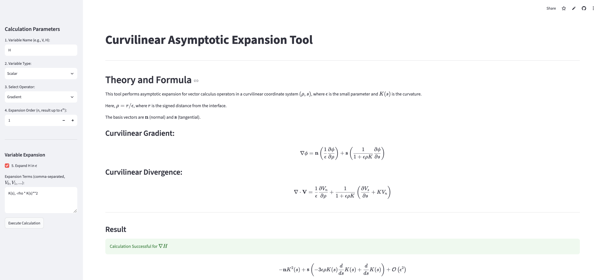

# Curvilinear Symbolic Calculator Tool

🚀 **Live Interactive Web App:** [https://curvilinear-symbolic-calc-tool.streamlit.app/](https://curvilinear-symbolic-calc-tool.streamlit.app/) 🚀

This repository implements a symbolic calculus engine and interactive web interface to perform asymptotic expansions for vector calculus operators in curvilinear coordinates. It is designed to automate the complex, multi-term mathematical expansions required for asymptotic analysis in phase-field modeling and related fields.

### The Governing Mathematics

The tool calculates symbolic expansions for operators in a curvilinear coordinate system $(\rho, s)$. The spatial framework relies on a small parameter $\epsilon$ and curvature $K(s)$.

Where:
* $\rho$: The scaled normal coordinate, defined as $\rho = r/\epsilon$, where $r$ is the signed distance from the interface.
* $\epsilon$: A small parameter (in phase-field modeling, this typically represents the diffuse interface thickness).
* $K(s)$: The local interface curvature along the tangential coordinate $s$.
* **n** and **s**: The normal and tangential basis vectors.

**Curvilinear Gradient:**
$$\nabla \phi = \mathbf{n} \left(\frac{1}{\epsilon}\frac{\partial \phi}{\partial \rho}\right) + \mathbf{s} \left(\frac{1}{1 + \epsilon \rho K}\frac{\partial \phi}{\partial s}\right)$$

**Curvilinear Divergence:**
$$\nabla \cdot \mathbf{V} = \frac{1}{\epsilon} \frac{\partial V_n}{\partial \rho} + \frac{1}{1 + \epsilon \rho K} \left( \frac{\partial V_s}{\partial s} + K V_n \right)$$

### Web Interface Screenshot
 

### Project Architecture

* `core/symbolic_engine.py` : The backend SymPy engine containing the curvilinear expansion calculus logic.
* `app.py` : The Streamlit front-end architecture for the interactive web deployment.
* `requirements.txt` : Dependency definitions for Python environment reproduction.

### Installation

```bash
git clone https://github.com/LingxiaS/Curvilinear-SymbolicCalc-tool.git
cd Curvilinear-SymbolicCalc-tool
pip install -r requirements.txt